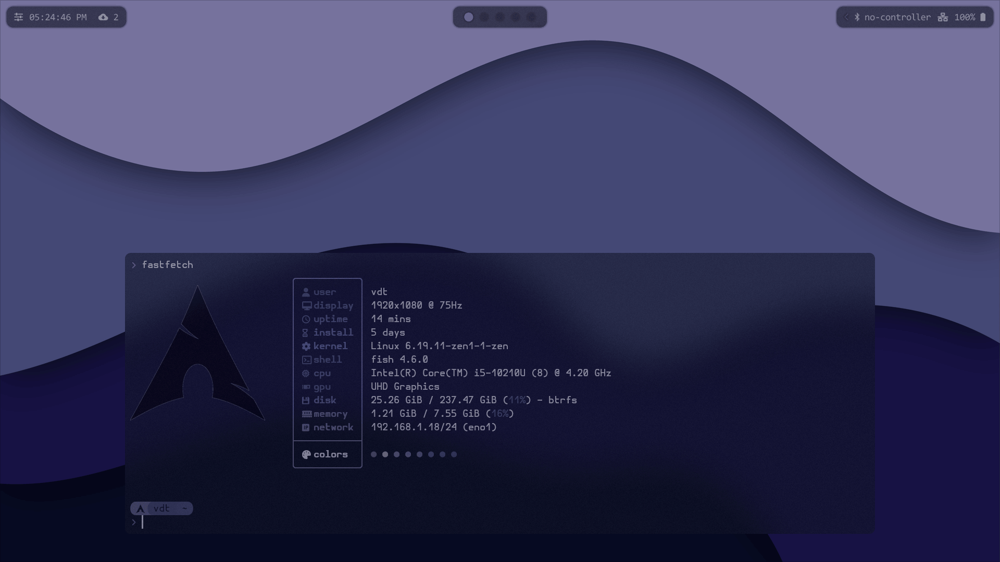
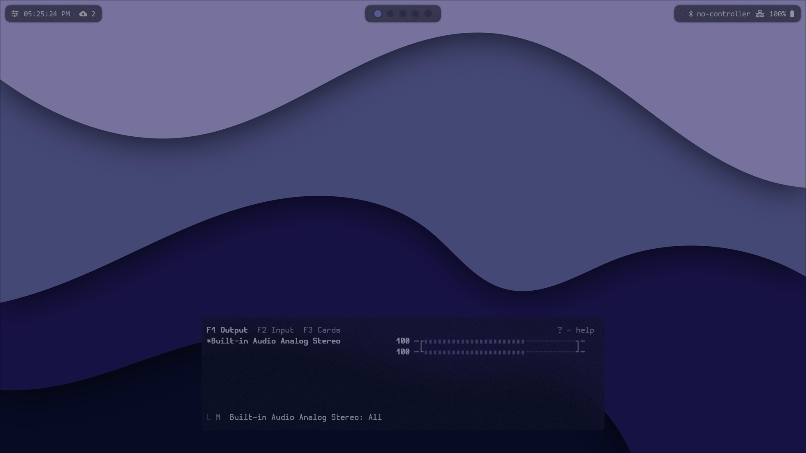
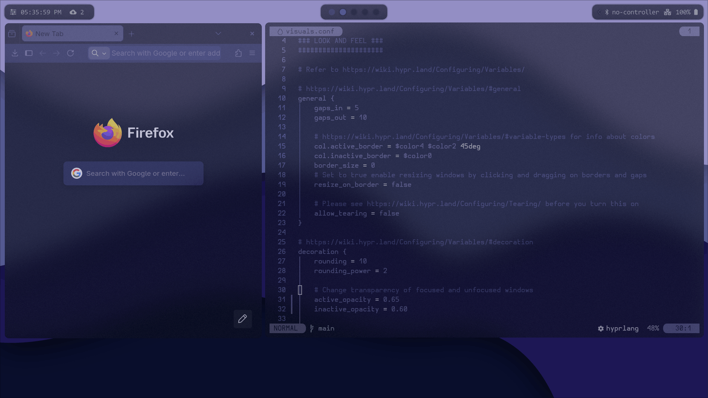
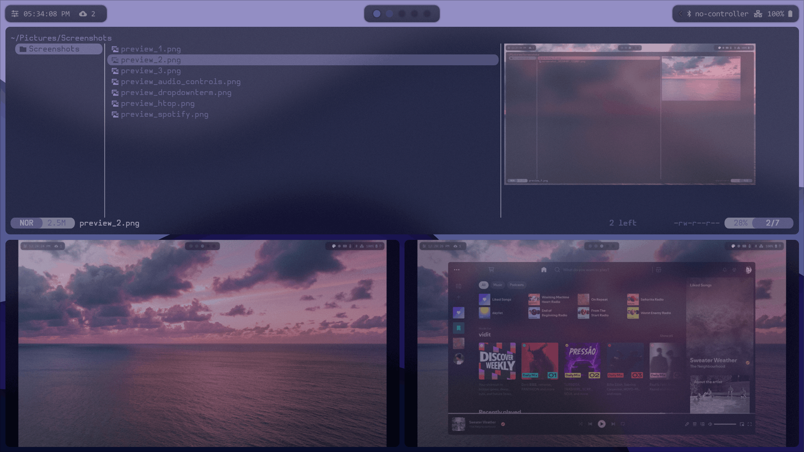
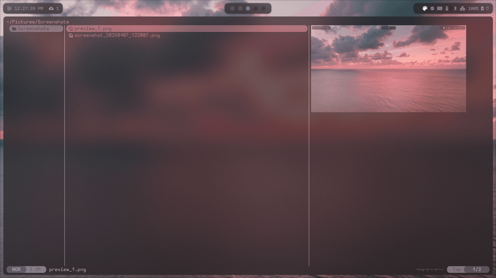

#  coreVidit's Dotfiles
A clean, modular, and beginner-friendly Hyprland environment for Arch Linux.

> [!IMPORTANT]
> **Welcome!** While this setup is designed for everyone, the documentation is **detailed and explanatory** to specifically help users who are new to Hyprland and Arch Linux. It provide a stable, "one-script" installation path to a fully productive environment.

##  Visual Preview

<p align="center">
  
  
</p>
<p align="center">
  
  
  
</p>
<p align="center">
  
</p>

###  Extra Screenshots
<p align="center">
  
  
  
</p>

---

## Safety & Compatibility

> [!CAUTION]
> **OS SUPPORT**: This project is built and tested for **Arch Linux** and its derivatives (Manjaro, EndeavourOS, etc.).
> **OTHER SYSTEMS**: You *can* technically achieve this setup on other distros by manually copying the directories, but fixing path bugs or broken links will be your responsibility.
> **INSTALLER BEHAVIOR**: The `install.sh` script will automatically move any existing configuration folders in `~/.config/` to `.bak` before creating its own symlinks. Your data is never deleted, just moved aside.

---

## ✨ Features & Highlights

###  Modular Architecture
Unlike monolithic configs, this setup uses a **source-based hierarchy**. Settings for visuals, keybinds, programs, and input are all split into separate files in `hypr/source/`. This makes it incredibly easy for a beginner to tweak one thing without breaking the rest.

###  Instant Global Theming
The installer is smart. It doesn't just copy files—it initializes your system. It automatically:
- Copies a default wallpaper to `~/wallpapers`.
- Generates a `pywal` color palette immediately.
- Syncs those colors to your Terminal (Kitty), Status Bar (Waybar), Notifications (SwayNC), and Browser (via Pywalfox).
- **No manual setup required**—the first time after you run the script, everything will already be themed.

###  WayClick Engine (From Dusky's dotfiles)
A self-bootstrapping mechanical keyboard sound emulator. On its first run, it builds its own Python environment and installs its own audio dependencies. It's portable, reliable, and completely "set-it-and-forget-it."

###  Power Tools
- **OCR to Clipboard**: Extract text from any part of your screen instantly (`Alt + T`).
- **Google Lens Integration**: Select a region and search the web for it (`Alt + I`).
- **Native Scratchpads**: Uses Hyprland's native special workspaces for dropdown Terminals, Spotify, and System Monitors. Light on resources, heavy on utility.

---

##  Repository Structure

| Directory | What's inside? |
|---|---|
| `hypr/` | Core WM logic, modular source files, locker, and idler. |
| `waybar/` | Your status bar. Includes 4 distinct switchable themes (Zen, Line, etc.). |
| `user_scripts/` | The "brains" of the setup—brightness, OCR, toggles, and more. |
| `wayclick/` | Everything needed for keyboard sound emulation. |
| `kitty/` | Terminal configuration with dynamic pywal theme support. |
| `vicinae/` | The application launcher. |
| `swaync/` | Notification center styles and settings. |

---

##  Installation

### 1. Clone the repository
We recommend keeping the folder at `~/dotfiles` to ensure all custom keybind paths stay aligned perfectly.
```bash
git clone https://github.com/coreVidit/dotfiles ~/dotfiles
cd ~/dotfiles
```

### 2. Run the installer
```bash
bash install.sh
```

**The installer will handle the heavy lifting:**
1. **AUR Helper**: If you don't have `paru` or `yay`, it will prompt you and install one for you.
2. **Dependencies**: It verifies and installs ~45 required packages automatically.
3. **Backups**: Automatically renames existing config folders to `.bak`.
4. **Theme Initialization**: Sets your first wallpaper and generates colors immediately.

---

##  Post-Installation Checklist

**1. WayClick First Run**  
You must run the WayClick script once in a terminal to finish its automated environment setup:
```bash
~/user_scripts/wayclick/dusky_wayclick.sh
```
**2. Pywalfox Extension**
Ensure you have the Pywalfox Extension installed on Firefox for complete experience.

**3. Permissions**  
Ensure your user has access to input devices and brightness controls:
```bash
sudo usermod -aG input,video,i2c $USER
```
*(A logout and back in is required for this to take effect).*

---

##  Essential Keybinds

| Category | Command | Keys |
|---|---|---|
| **General** | App Launcher | `Alt + Space` |
| | Kill Window | `Super + X` |
| | Lock Screen | `Super + M` |
| **Workspace** | Dropdown Terminal | `Alt + 1` |
| | System Monitor | `Alt + 3` |
| | Spotify | `Alt + S` |
| **Utilities** | Google Lens Search | `Alt + I` |
| | OCR to Clipboard | `Alt + T` |
| | Toggle Keyboard Sounds | `Alt + U` |
| **Customization**| Wallpaper Picker | `Alt + W` |
| | Waybar Theme | `Alt + B` |

---

> [!TIP]
> **Full Keybind List**: For a complete list of all bindings, see your local configuration file at:  
> `~/dotfiles/hypr/source/keybinds.conf`

---

## ❓ Troubleshooting & FAQ

### 1. Firefox (Pywalfox) colors aren't updating!
While the installer sets up the Python backend, you still need the extension. 
**Fix**: Install the [Pywalfox Add-on](https://addons.mozilla.org/en-US/firefox/addon/pywalfox/?utm_source=addons.mozilla.org&utm_medium=referral&utm_content=search) in Firefox. Open its settings and click "Fetch Pywal Colors" once to establish the initial connection. It will auto-update afterward.

### 2. My Brightness/Volume keys don't work!
By default, the dotfiles bind standard `F_` keys to SwayOSD audio/brightness controls. 
**Fix**: 
- **Reboot**: If you just ran the installer, you must reboot for the `i2c-dev` kernel module to load (required for external monitor brightness).
- **Update Binds**: Since laptop function rows vary, open `hypr/source/keybinds.conf` and scroll to the bottom. Change the mapped `F2/F3` keys to match your specific laptop's hardware keys, or replace them with the `XF86Audio...` and `XF86MonBrightness...` equivalents.

### 3. WayClick (Keyboard Sounds) is completely silent!
WayClick reads raw input events, which requires strict permissions.
**Fix**: Ensure you have rebooted since running the installer. The installer adds your user to the `input` group, but Linux requires a new session for group changes to take effect. Also, ensure you ran the setup command (`~/user_scripts/wayclick/dusky_wayclick.sh --setup`) at least once!

---

*Enjoy your new Arch Linux experience!*

These dotfiles are result of scraped together features from other's dotfiles and some my own hotfixes, tailored for me.
